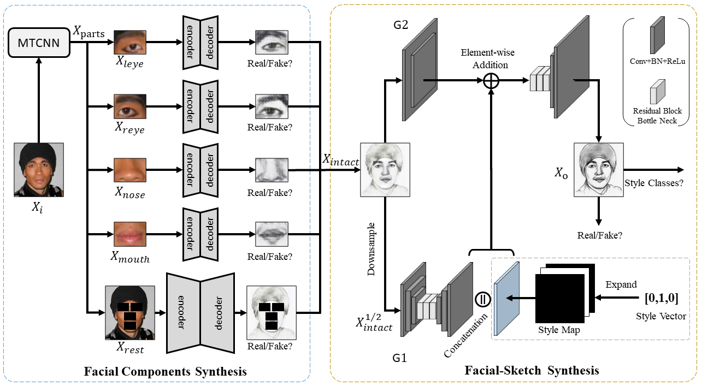

# FSGAN

+ Here is the official PyTorch implementation for our paper "Deep Facial Synthesis: A New Challenge".

+ This project achieve the translation between face photos and artistic portrait drawings using a GAN-based model.
    You may find useful information in  [training/testing tips](docs/tips.md).

+ 📕Find our paper on [Springer](https://link.springer.com/article/10.1007/s11633-022-1349-9) [Machine Intelligence Research](https://www.mi-research.net/en/article/doi/10.1007/s11633-022-1349-9) [arXiv](https://arxiv.org/abs/2112.15439).

+ ✨Try our online [**Colab demo**](https://colab.research.google.com/drive/1rv49wo3b4AZIIbEQdVQR2RfZF4p7YIOl?usp=sharing) to generate your own facial sketches.

+ Find the introduction video made by MIR:

https://finder.video.qq.com/251/20302/stodownload?X-snsvideoflag=xV1&adaptivelytrans=0&bizid=1023&dotrans=2991&encfilekey=Cvvj5Ix3eewK0tHtibORqcsqchXNh0Gf3sJcaYqC2rQCRC5RWkqYv3dV7SEW5a9N01h0AvmuRiaYEqnAcldU66aBPH2PTmzn3Qa1DKT05KEt8HBOSDysxwZa0cj6LweLjW&hy=SH&idx=1&m=&token=AxricY7RBHdVibDwHFh9wXhBnheDSxI6VAtOdxXJkA5Xhpzh7Ql0Ya9c28PTtF6ziccKfEJ5X8ay9k&websvrscene=8

## Our Proposed Framework



## Sample Results

#### Facial Sketch Synthesis

|                       *Style-1*                       |                      *Style-2*                       |                       *Style-3*                       |
| :---------------------------------------------------: | :--------------------------------------------------: | :---------------------------------------------------: |
|  |  |   |
|   |  |   |
|   |  |  |

#### Teaser


## Prerequisites
- Ubuntu >= 18.04
- Python >= 3.6
- Our model can only train on GPU >=32 GB at present


## Getting Started
### Installation
- Install Pytorch\=\=1.9.0, torchvision\=\=0.10.0 and other dependencies (e.g., [visdom](https://github.com/facebookresearch/visdom) and [dominate](https://github.com/Knio/dominate)). You can install all the dependencies by
```bash
pip install -r requirements.txt
```

### Dataset

We conduct all the experiments on the currently largest Facial Sketch Synthesis (FSS) dataset FS2K. For more details about this dataset, please visit its [repo](https://github.com/DengPingFan/FS2K).

In this project, we follow the [APDrawingGAN](https://github.com/yiranran/APDrawingGAN/) to do some preprocessing on original images, including aligning photo by key points ([MTCNN](https://arxiv.org/abs/1604.02878)), segment human portrait regions ([U2-Net](https://arxiv.org/abs/2005.09007)). You can download the preprocessed FS2K dataset [here](https://drive.google.com/drive/folders/1A7EphDz3-Y2k9v1SBTY-dEQ7lxKD7wTt?usp=sharing).

**If you want to conduct the preprocessing on other images, see [preprocessing section](preprocess/readme.md).**

### Train
- Run `python -m visdom.server`

- ```shell
  python train.py --dataroot /home/pz1/datasets/fss/FS2K_data/train/photo/ --checkpoints_dir checkpoints --name ckpt_0 \
  --use_local --discriminator_local --niter 150 --niter_decay 0 --save_epoch_freq 1
  ```

+ If you run on DGX-server, you can use `sub_by_id.sh` to set up many experiments one time.
+ To see losses in training, please refer to log file [slurm.out](https://github.com/DengPingFan/FSGAN/blob/main/slurm-221823.out).

### Test

Download the weights of pretrained models from the [folder for this FSS task](https://drive.google.com/drive/folders/1A7EphDz3-Y2k9v1SBTY-dEQ7lxKD7wTt?usp=sharing) on google-drive and specify the path of weights in train/test shell script.

- To test a single model, please run `single_model_test.sh`.
- To test a series of models, please run `test_ours.sh`.
- Remember to specify the exp_id and epoch_num in these shell scripts.
- You can also download our results and all other relevant stuff in this [google-drive folder](https://drive.google.com/drive/folders/1A7EphDz3-Y2k9v1SBTY-dEQ7lxKD7wTt?usp=sharing).


## [Training/Test Tips](docs/tips.md)
Best practice for training and testing your models.

## Acknowledgments
Thanks to the great codebase of [APDrawingGAN](https://github.com/yiranran/APDrawingGAN).

## Citation

If you find our code and metric useful in your research, please cite our papers.

```
@aticle{Fan2022FS2K,
  title={Facial-Sketch Synthesis: A New Challenge},
  author={Deng-Ping, Fan and Ziling, Huang and Peng, Zheng and Hong, Liu and Xuebin, Qin and Luc, Van Gool},
  journal={Machine Intelligence Research},
  year={2022}
}

@inproceedings{fan2019scoot,
  title={Scoot: A perceptual metric for facial sketches},
  author={Fan, Deng-Ping and Zhang, ShengChuan and Wu, Yu-Huan and Liu, Yun and Cheng, Ming-Ming and Ren, Bo and Rosin, Paul L and Ji, Rongrong},
  booktitle={Proceedings of the IEEE/CVF International Conference on Computer Vision},
  pages={5612--5622},
  year={2019}
}
```

## 
